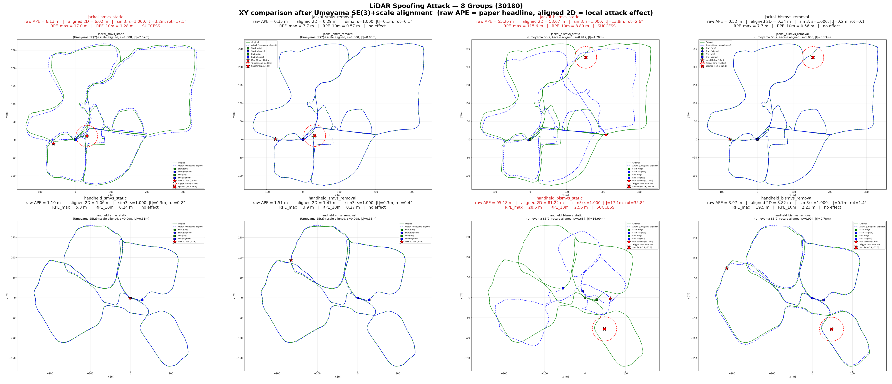
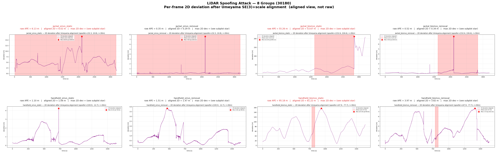

# Muti-sensor SLAM Attack

## 概述

将 SLAMSpoof (ICRA 2025) LiDAR 欺骗攻击框架移植到 **LVI-SAM**（LiDAR-视觉-惯性紧耦合）。

原版 SLAMSpoof 攻击 A-LOAM / KISS-ICP 等纯 LiDAR SLAM，共两种模式：
- **`removal`**：HFR 噪声攻击，删除攻击窗口内点并注入随机噪声
- **`static`**：圆柱形假墙注入，在固定距离上均匀注入伪造点

本工作在此基础上扩展到 LVI-SAM：

| | 原版 SLAMSpoof | 本工作 |
|---|---|---|
| 目标 SLAM | A-LOAM / KISS-ICP（纯 LiDAR） | LVI-SAM（LiDAR-视觉） |
| 保留 Topic | LiDAR + IMU | LiDAR、Camera、IMU、GPS|
| 点云格式 | xyz-only | 完整 22 字节 Velodyne 布局 |
| SMVS | 仅 LiDAR（G-ICP Hessian 特征值） | LiDAR + 视觉双模态融合（Bi-Vul） |
| 假墙几何 | 均匀随机圆柱墙 | 新增：束投影 / 菱形集中 / L 形墙角 |
| 动态攻击 | 无 | 动墙注入 + 由 $M_{corr}$ 推导最优振荡周期 |

> `square` / `corner` / 动态振荡由 D-SLAMSpoof 论文提出；双模态 SMVS（Bi-Vul）为本工作的扩展。

---

## 攻击模式

### 1. `removal` — HFR 噪声攻击
删除攻击窗口内真实点，注入随机噪声点。模拟硬件干扰或信号阻塞。

### 2. `static` — 假墙注入

**原版**：圆柱形均匀假墙（`original_random`），在 `wall_dist` 距离上均匀注入伪造点，几何约束分散。

**本工作扩展**（由 D-SLAMSpoof 论文提出 `square`/`corner`，其余为本工作）：

| 模型 | 来源 | 描述 |
|---|---|---|
| `original_random` | 原版 | 均匀随机角度分布的圆柱墙，几何约束分散 |
| `beam_project` | 本工作 | 沿原 scan line 方向投影到固定距离，继承 ring/time |
| `square` | D-SLAMSpoof | 菱形集中几何（极坐标方程），约束集中在边缘方向 |
| `corner` | D-SLAMSpoof | L 形墙角（square + rotate=0），两侧边缘面向 LiDAR |


### 3. `dynamic` — 动墙注入
墙距离在 `[wall_distance_min, wall_distance_max]` 之间周期性振荡，周期由 $M_{corr}$ 自动推导：
```
t_cycle = (d_max - d_min) / M_corr × Δt
```
该周期是**最快且不被 outlier filtering 拒绝**的振荡频率。

---

## 快速开始

### 硬件需求
- ROS Noetic + Catkin Tools
- LVI-SAM（`~/catkin_ws/devel_catkin_tools`）
- `small_gicp`（G-ICP 后端）
- 数据集：`~/catkin_ws/src/LVI-SAM/datasets/xxx.bag`

### 环境准备
```bash
source /opt/ros/noetic/setup.bash
source ~/catkin_ws/devel_catkin_tools/setup.bash
```

---

## 完整实验流程

### 阶段 1：录制原始轨迹（基线）

```bash
# ========== 终端 1 ==========
source /opt/ros/noetic/setup.bash
source ~/catkin_ws/devel_catkin_tools/setup.bash
rosparam set use_sim_time true
roslaunch lvi_sam run.launch

# ========== 终端 2 ==========
source /opt/ros/noetic/setup.bash
source ~/catkin_ws/devel_catkin_tools/setup.bash
mkdir -p ~/catkin_ws/src/LVI-SAM/datasets/slamspoof_handheld/original
rosbag record -O ~/catkin_ws/src/LVI-SAM/datasets/slamspoof_handheld/original/handheld_original_traj.bag /lvi_sam/lidar/mapping/odometry

# ========== 终端 3 ==========
source /opt/ros/noetic/setup.bash
source ~/catkin_ws/devel_catkin_tools/setup.bash
rosbag play ~/catkin_ws/src/LVI-SAM/datasets/handheld.bag --clock --pause
```

bag 播放完毕后（终端 3 自动结束），提取轨迹：

```bash
python3 ~/catkin_ws/src/slamspoof/scripts/extract_lvisam_odom_csv.py \
    --bag ~/catkin_ws/src/LVI-SAM/datasets/slamspoof_handheld/original/handheld_original_traj.bag \
    --out ~/catkin_ws/src/LVI-SAM/datasets/slamspoof_handheld/original/handheld_original_traj.csv
```
---

### 阶段 2：采集双模态 SMVS

```bash
# ========== 终端 1 ==========
source /opt/ros/noetic/setup.bash
source ~/catkin_ws/devel_catkin_tools/setup.bash
rosparam set use_sim_time true
roslaunch lvi_sam run.launch

# ========== 终端 2 ==========
source /opt/ros/noetic/setup.bash
source ~/catkin_ws/devel_catkin_tools/setup.bash
roslaunch slamspoof_icra run_bimodal_smvs_lvisam.launch

# ========== 终端 3 ==========
source /opt/ros/noetic/setup.bash
source ~/catkin_ws/devel_catkin_tools/setup.bash
rosbag play ~/catkin_ws/src/LVI-SAM/datasets/handheld.bag --clock
```

输出文件（由 launch 文件 `smvs_save_dir` / `vulnerablity_save_dir` 参数指定）：
```
slamspoof_handheld/smvs/{timestamp}.csv      # 帧级 SMVS 分数
slamspoof_handheld/vul/vul_{timestamp}.csv  # 分方向脆弱性
```

---

### 阶段 3：选择 Spoofer 位置

```bash
# 【重要】将路径替换为阶段 2 新生成的 CSV 文件
python3 ~/catkin_ws/src/slamspoof/scripts/select_spoofer_from_bimodal.py \
    --smvs ~/catkin_ws/src/LVI-SAM/datasets/slamspoof_handheld/smvs/{timestamp}.csv \
    --vul  ~/catkin_ws/src/LVI-SAM/datasets/slamspoof_handheld/vul/vul_{timestamp}.csv \
    --score-column frame_bi_smvs \
    --score-threshold 0.0 \
    --top-k 10 \
    --verbose \
    --match-mode nearest_xy
```

输出中的 `spoofer_x` 和 `spoofer_y` 填入 `config_lvisam.json`（见下阶段）

---

### 阶段 4：生成攻击 Rosbag

修改配置（config_lvisam：修改路径/攻击模式/攻击参数）：

```json
{
  "main": {
    "input_file": "/home/qu_menghao/catkin_ws/src/LVI-SAM/datasets/handheld.bag",
    "output_file": "/home/qu_menghao/catkin_ws/src/LVI-SAM/datasets/slamspoof_handheld/attack_static/handheld_attack_static.bag",
    "reference_file": "/home/qu_menghao/catkin_ws/src/LVI-SAM/datasets/slamspoof_handheld/original/handheld_original_traj.csv",
    "spoofing_mode": "static",
    "spoofer_x": <阶段3输出>,
    "spoofer_y": <阶段3输出>,
    "static_geometry_model": "square",
    "wall_dist": 15.0
  }
}
```

生成攻击 bag：

```bash
source /opt/ros/noetic/setup.bash
source ~/catkin_ws/devel_catkin_tools/setup.bash
roslaunch slamspoof_icra rosbag_editer_lvisam.launch config_file_path:=/home/qu_menghao/catkin_ws/src/slamspoof/config_lvisam_handheld.json
```

---

### 阶段 5：录制攻击轨迹

```bash
# ========== 终端 1 ==========
source /opt/ros/noetic/setup.bash
source ~/catkin_ws/devel_catkin_tools/setup.bash
rosparam set use_sim_time true
roslaunch lvi_sam run.launch

# ========== 终端 2 ==========
source /opt/ros/noetic/setup.bash
source ~/catkin_ws/devel_catkin_tools/setup.bash
mkdir -p ~/catkin_ws/src/LVI-SAM/datasets/slamspoof_handheld/attack_static
rosbag record -O ~/catkin_ws/src/LVI-SAM/datasets/slamspoof_handheld/attack_static/handheld_attack_static_traj.bag \
    /lvi_sam/lidar/mapping/odometry

# ========== 终端 3 ==========
source /opt/ros/noetic/setup.bash
source ~/catkin_ws/devel_catkin_tools/setup.bash
rosbag play ~/catkin_ws/src/LVI-SAM/datasets/slamspoof_handheld/attack_static/handheld_attack_static.bag --clock
```

bag 播放完毕后，提取轨迹：

```bash
python3 ~/catkin_ws/src/slamspoof/scripts/extract_lvisam_odom_csv.py \
    --bag ~/catkin_ws/src/LVI-SAM/datasets/slamspoof_handheld/attack_static/handheld_attack_static_traj.bag \
    --out ~/catkin_ws/src/LVI-SAM/datasets/slamspoof_handheld/attack_static/handheld_attack_static_traj.csv
```

---

### 阶段 6：轨迹对比

```bash
mkdir -p ~/catkin_ws/src/LVI-SAM/datasets/slamspoof_handheld/compare

python3 ~/catkin_ws/src/slamspoof/scripts/compare_lvisam_traj_csv.py \
    --orig ~/catkin_ws/src/LVI-SAM/datasets/slamspoof_handheld/original/handheld_original_traj.csv \
    --att  ~/catkin_ws/src/LVI-SAM/datasets/slamspoof_handheld/attack_static/handheld_attack_static_traj.csv \
    --out-prefix ~/catkin_ws/src/LVI-SAM/datasets/slamspoof_handheld/compare/handheld_static_compare \
    --title "Handheld: Original vs static Attack" \
    --spoofer-x <spoofer_x> \
    --spoofer-y <spoofer_y> \
    --wall-dist 15.0 \
    --spoofing-range 80.0
```

---

## 关键参数说明

| 参数 | 说明 | 常用值 |
|---|---|---|
| `spoofing_mode` | 攻击模式 | `removal` / `static` / `dynamic` |
| `spoofer_x/y` | Spoofer 世界坐标 | 从阶段 3 获取 |
| `distance_threshold` | 触发半径 | 5 ~ 15 m |
| `spoofing_range` | 攻击窗口总角度 | 80° ~ 160° |
| `wall_dist` | 假墙固定距离（static） | 10 ~ 20 m |
| `wall_distance_min/max` | 动墙距离范围（dynamic） | 5 ~ 25 m |
| `static_geometry_model` | 假墙几何 | `original_random` / `beam_project` / `square` / `corner` |
| `square_rotate_rad` | 菱形旋转角 | 0（corner）/ π/4（平面） |
| `M_corr` | SLAM 最大对应距离 | 1.0 m（LVI-SAM） |
| `auto_cycle` | 自动推导最优振荡周期 | `true` |

---

## 项目结构

```
slamspoof/
├── scripts/
│   ├── BimodalSpoofingSimulation.py      # 双模态 SMVS 节点
│   ├── spoofing_editer_lvisam.py          # Rosbag 攻击编辑器
│   ├── select_spoofer_from_bimodal.py      # Spoofer 位置选择
│   ├── compare_lvisam_traj_csv.py         # 轨迹对比
│   └── functions/
│       ├── spoofing_sim_lvisam.py          # 攻击函数（6种模式）
│       └── calc_bimodal_smvs.py            # 双模态 SMVS 计算
├── launch/
│   ├── run_bimodal_smvs_lvisam.launch      # 双模态 SMVS（含节点启动）
│   └── rosbag_editer_lvisam.launch         # Rosbag 编辑器
├── config_lvisam.json                      # Jackal 配置
└── config_lvisam_handheld.json            # Handheld 配置
```

---

## 实验结果


## 8 组 d=30 spoof_range=180 攻击评估
### 4 个 Spoofer 坐标

| Platform × Method | spoofer_x | spoofer_y |
|---|---|---|
| **jackal + bismvs**   | `152.55`     | `226.58`     |
| **jackal + smvs**     | `32.277679`  | `10.812261`  |
| **handheld + smvs**   | `193.907815` | `-12.706408` |
| **handheld + bismvs** | `47.85`      | `-77.70`     |

### 8 组攻击指标总表

| Group | raw APE | aligned 2D | RPE-max | RPE-10m | 平移量 | 旋转角 | zone_s | zone RMSE | onset 1m | drift |
|---|---|---:|---:|---:|---:|---:|---:|---:|---:|---:|
| jackal_smvs_static    |  6.13 |   6.02 |   17.00 | 1.28 |  3.20 m | 17.08° | **295.10** |   8.56 |    71.41 |  -0.00 |
| jackal_smvs_removal   |  0.35 |   0.29 |    7.71 | 0.57 |  0.07 m |  0.10° |  295.10 |   0.04 |  1366.86 |   0.00 |
| jackal_bismvs_static  | 55.26 |  53.67 |  115.64 | 8.89 | 13.80 m |  2.61° |   65.76 |   0.56 |  1366.45 |  -0.00 |
| jackal_bismvs_removal |  0.52 |   0.34 |    7.71 | 0.56 |  0.24 m |  0.08° |   65.76 |   0.34 |  1366.86 |   0.00 |
| handheld_smvs_static  |  1.10 |   1.06 |    5.25 | 0.24 |  0.33 m |  0.19° |    0.00 |     – |   341.92 |     – |
| handheld_smvs_removal |  1.51 |   1.47 |    3.92 | 0.27 |  0.32 m |  0.41° |    0.00 |     – |   134.95 |     – |
| handheld_bismvs_static  | 95.18 |  81.22 |   28.61 | 2.56 | 17.08 m | 35.80° |   47.60 | **34.12** |   124.26 | **1.15** |
| handheld_bismvs_removal |  3.97 |   3.82 |   19.46 | 2.23 |  0.74 m |  1.43° |   47.60 |   1.81 |   245.90 |   0.05 |

**列含义**：

- `raw APE`：SLAMSpoof 论文头号指标，evo Sim3 对齐后 3D RMSE
- `aligned 2D`：Umeyama SE(2)+scale 对齐后 2D RMSE
- `RPE-max` / `RPE-10m`：evo RPE，max 值和 10 m 基线 RMSE
- `sim3 |t|` / `sim3 rot°`：evo 内部 Sim3 对齐的平移范数和旋转角
- `zone_s`：机器人在 spoofer 30 m 范围内累计时长
- `zone RMSE`：触发带内 2D RMSE
- `onset 1m`：2D 偏差首次超 1 m 的时间
- `drift`：触发带内漂移速度 m/s

### 总图：8 组 XY 对齐后的结果 + 8 组偏差

| 8 组 XY 轨迹（Umeyama 对齐后） | 8 组逐帧 2D 偏差（对齐后） |
|---|---|
|  |  |


### v3 验证主要发现

1. **3/8 组达到 attack success（APE ≥ 4.2 m）**：
   - `jackal_smvs_static`（APE = 6.13 m，spoofer 离起点仅 35 m，几乎全程 295 s 在触发带内）
   - `jackal_bismvs_static`（APE = 55.26 m，仅 65 s 触发但单次爆点 213 m）
   - `handheld_bismvs_static`（APE = 95.18 m，47 s 触发但单次爆点 156 m，drift 1.15 m/s）

2. **SMVS 与 BiSMVS 是两种完全不同的攻击风格**：
   - **SMVS = 慢性毒药**：spoofer 离路径很近（jackal 32 m / handheld 194 m），机器一进带就**持续小偏移累积**（jackal_smvs_static 在带内 295 s 累积出 16.6 m 峰值）。**整张图偏差持续在**。
   - **BiSMVS = 狙击**：spoofer 离路径远（jackal 152 m / handheld 47 m），进带**时间短（47-66 s）但单次峰值巨大（156-213 m）**，SLAM 直接崩溃/回环重置。

3. **APE 数字与 spoofer 位置无关**：APE / RPE 来自 evo 输出，**从来没受 spoofer_xy 写错影响**。修正前的 8 组 spoofer 坐标错误只影响 `attack_metrics`（zone 触发带分析），已按用户确认的 4 个坐标重算。

4. **`handheld_smvs_{static,removal}` 两条 `success=False` 的本质是 attack 根本没触发**：
   - 路径从不经过 spoofer (193.9, -12.7) 的 30 m 圈，`zone_s = 0`
   - 1.10 m / 1.51 m APE 完全来自 SLAM 自身漂移，不是 attack 效果

5. **8/8 组中 `removal` 模式全部 `success=False`**：
   - `removal` 只删点不注入假点，攻击强度远低于 `static`
   - 4 组 removal 的 APE 都在 0.35-3.97 m 之间，**未达 4.2 m success 阈值**
   - 这与 SLAMSpoof 论文中 `removal` 在 LiDAR-only SLAM 上效果较弱的结论一致


## 引用

```bibtex
@inproceedings{slamspoof2025,
  title={SLAMSpoof: Practical LiDAR Spoofing Attacks on Localization
         Systems Guided by Scan Matching Vulnerability Analysis},
  author={Nagata, R. and Koide, K. and Hayakawa, Y. and Suzuki, R.
          and Ikeda, K. and Sako, O. and Chen, Q.A. and Sato, T.
          and Yoshioka, K.},
  booktitle={ICRA},
  year={2025}
}

@inproceedings{lvisam2021shan,
  title={LVI-SAM: Tightly-coupled Lidar-Visual-Inertial Odometry
         via Smoothing and Mapping},
  author={Shan, T. and Englot, B. and Ratti, C. and Rus, D.},
  booktitle={ICRA},
  pages={5692--5698},
  year={2021}
}
```
