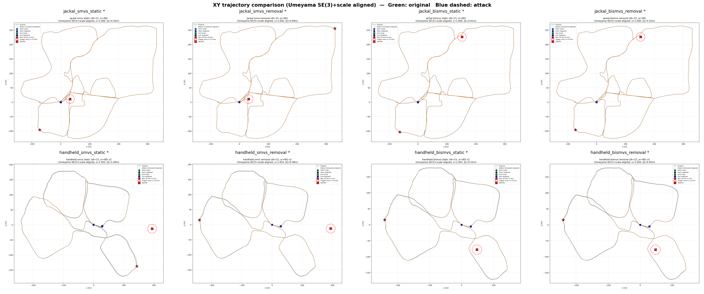
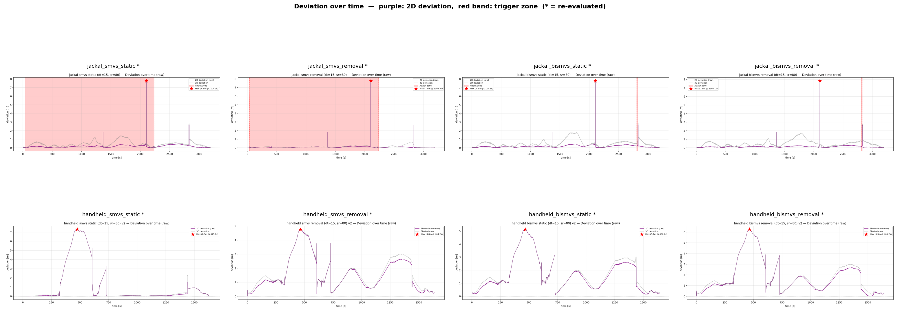
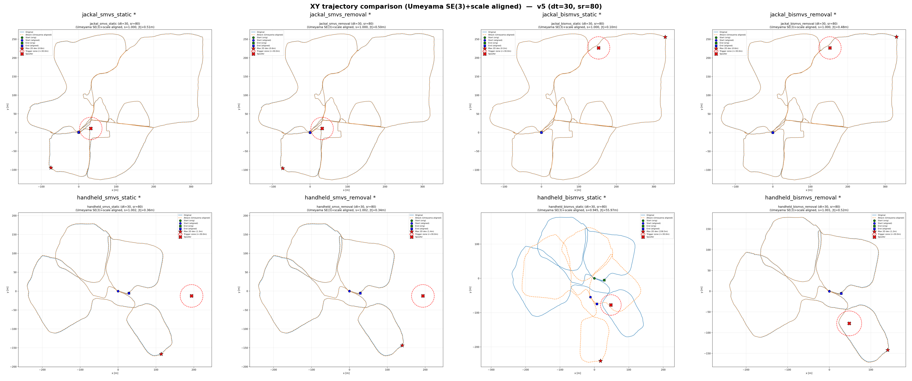
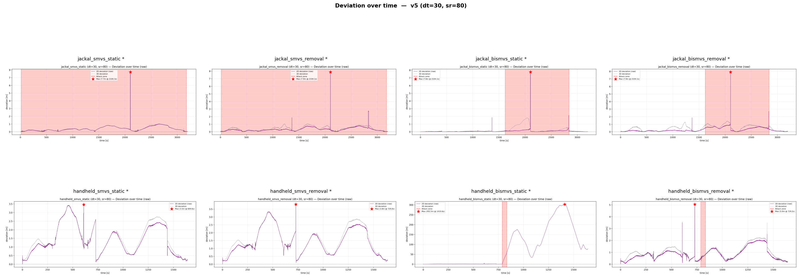

# LV-SLAM Attack

## 概述
SLAMSpoof (ICRA 2025) LiDAR 欺骗攻击框架移植到 **LVI-SAM**类LiDAR-视觉-惯性耦合SLAM系统


### 1. `removal` — HFR 噪声攻击
删除攻击窗口内真实点，注入随机噪声点。模拟硬件干扰或信号阻塞。

### 2. `static` — 假墙注入

**原版**：圆柱形均匀假墙（`original_random`），在 `wall_dist` 距离上均匀注入伪造点，几何约束分散。

**扩展**（由 D-SLAMSpoof 论文提出 `square`/`corner`，其余为本工作）：

| 模型 | 来源 | 描述 |
|---|---|---|
| `original_random` | 原版 | 均匀随机角度分布的圆柱墙，几何约束分散 |
| `beam_project` | 本工作 | 沿原 scan line 方向投影到固定距离，继承 ring/time |
| `square` | D-SLAMSpoof | 菱形集中几何（极坐标方程），约束集中在边缘方向 |
| `corner` | D-SLAMSpoof | L 形墙角（square + rotate=0），两侧边缘面向 LiDAR |


### 3. `dynamic` — 动墙注入
墙距离在 `[wall_distance_min, wall_distance_max]` 之间周期性振荡，周期由 $M_{corr}$ 自动推导：
```
t_cycle = (d_max - d_min) / M_corr × Δt
```
该周期是**最快且不被 outlier filtering 拒绝**的振荡频率。

---

## 快速开始

### 需求
- ROS Noetic + Catkin Tools
- LVI-SAM（`~/catkin_ws/devel_catkin_tools`）
- `small_gicp`（G-ICP 后端）
- 数据集：`~/catkin_ws/src/LVI-SAM/datasets/xxx.bag`

### 环境准备
```bash
source /opt/ros/noetic/setup.bash
source ~/catkin_ws/devel_catkin_tools/setup.bash
```

---

## 完整实验流程

### 阶段 1：录制原始轨迹（基线）

```bash
# ========== 终端 1 ==========
source /opt/ros/noetic/setup.bash
source ~/catkin_ws/devel_catkin_tools/setup.bash
rosparam set use_sim_time true
roslaunch lvi_sam run.launch

# ========== 终端 2 ==========
source /opt/ros/noetic/setup.bash
source ~/catkin_ws/devel_catkin_tools/setup.bash
mkdir -p ~/catkin_ws/src/LVI-SAM/datasets/slamspoof_handheld/original
rosbag record -O ~/catkin_ws/src/LVI-SAM/datasets/slamspoof_handheld/original/handheld_original_traj.bag /lvi_sam/lidar/mapping/odometry

# ========== 终端 3 ==========
source /opt/ros/noetic/setup.bash
source ~/catkin_ws/devel_catkin_tools/setup.bash
rosbag play ~/catkin_ws/src/LVI-SAM/datasets/handheld.bag --clock --pause
```

bag 播放完毕后（终端 3 自动结束），提取轨迹：

```bash
python3 ~/catkin_ws/src/slamspoof/scripts/extract_lvisam_odom_csv.py \
    --bag ~/catkin_ws/src/LVI-SAM/datasets/slamspoof_handheld/original/handheld_original_traj.bag \
    --out ~/catkin_ws/src/LVI-SAM/datasets/slamspoof_handheld/original/handheld_original_traj.csv
```
---

### 阶段 2：采集双模态 SMVS

```bash
# ========== 终端 1 ==========
source /opt/ros/noetic/setup.bash
source ~/catkin_ws/devel_catkin_tools/setup.bash
rosparam set use_sim_time true
roslaunch lvi_sam run.launch

# ========== 终端 2 ==========
source /opt/ros/noetic/setup.bash
source ~/catkin_ws/devel_catkin_tools/setup.bash
roslaunch slamspoof_icra run_bimodal_smvs_lvisam.launch

# ========== 终端 3 ==========
source /opt/ros/noetic/setup.bash
source ~/catkin_ws/devel_catkin_tools/setup.bash
rosbag play ~/catkin_ws/src/LVI-SAM/datasets/handheld.bag --clock
```

输出文件（由 launch 文件 `smvs_save_dir` / `vulnerablity_save_dir` 参数指定）：
```
slamspoof_handheld/smvs/{timestamp}.csv      # 帧级 SMVS 分数
slamspoof_handheld/vul/vul_{timestamp}.csv  # 分方向脆弱性
```

---

### 阶段 3：选择 Spoofer 位置

```bash
# 【重要】将路径替换为阶段 2 新生成的 CSV 文件
python3 ~/catkin_ws/src/slamspoof/scripts/select_spoofer_from_bimodal.py \
    --smvs ~/catkin_ws/src/LVI-SAM/datasets/slamspoof_handheld/smvs/{timestamp}.csv \
    --vul  ~/catkin_ws/src/LVI-SAM/datasets/slamspoof_handheld/vul/vul_{timestamp}.csv \
    --score-column frame_bi_smvs \
    --score-threshold 0.0 \
    --top-k 10 \
    --verbose \
    --match-mode nearest_xy
```

输出中的 `spoofer_x` 和 `spoofer_y` 填入 `config_lvisam.json`（见下阶段）

---

### 阶段 4：生成攻击 Rosbag

修改配置（config_lvisam：修改路径/攻击模式/攻击参数）：

```json
{
  "main": {
    "input_file": "/home/qu_menghao/catkin_ws/src/LVI-SAM/datasets/handheld.bag",
    "output_file": "/home/qu_menghao/catkin_ws/src/LVI-SAM/datasets/slamspoof_handheld/attack_static/handheld_attack_static.bag",
    "reference_file": "/home/qu_menghao/catkin_ws/src/LVI-SAM/datasets/slamspoof_handheld/original/handheld_original_traj.csv",
    "spoofing_mode": "static",
    "spoofer_x": <阶段3输出>,
    "spoofer_y": <阶段3输出>,
    "static_geometry_model": "square",
    "wall_dist": 15.0
  }
}
```

生成攻击 bag：

```bash
        source /opt/ros/noetic/setup.bash
	source ~/catkin_ws/devel_catkin_tools/setup.bash
	roslaunch slamspoof_icra rosbag_editer_lvisam.launch config_file_path:=/home/qu_menghao/catkin_ws/src/slamspoof/config_lvisam.json
```

---

### 阶段 5：录制攻击轨迹

```bash
# ========== 终端 1 ==========
source /opt/ros/noetic/setup.bash
source ~/catkin_ws/devel_catkin_tools/setup.bash
rosparam set use_sim_time true
roslaunch lvi_sam run.launch

# ========== 终端 2 ==========
source /opt/ros/noetic/setup.bash
source ~/catkin_ws/devel_catkin_tools/setup.bash
mkdir -p ~/catkin_ws/src/LVI-SAM/datasets/slamspoof_handheld/attack_static
rosbag record -O ~/catkin_ws/src/LVI-SAM/datasets/slamspoof_handheld/attack_static/handheld_attack_static_traj.bag \
    /lvi_sam/lidar/mapping/odometry

# ========== 终端 3 ==========
source /opt/ros/noetic/setup.bash
source ~/catkin_ws/devel_catkin_tools/setup.bash
rosbag play ~/catkin_ws/src/LVI-SAM/datasets/slamspoof_handheld/attack_static/handheld_attack_static.bag --clock
```

bag 播放完毕后，提取轨迹：

```bash
python3 ~/catkin_ws/src/slamspoof/scripts/extract_lvisam_odom_csv.py \
    --bag ~/catkin_ws/src/LVI-SAM/datasets/slamspoof_handheld/attack_static/handheld_attack_static_traj.bag \
    --out ~/catkin_ws/src/LVI-SAM/datasets/slamspoof_handheld/attack_static/handheld_attack_static_traj.csv
```

---

### 阶段 6：轨迹对比

```bash

python3 ~/catkin_ws/src/slamspoof/scripts/evaluate_attack.py \
	    --orig ~/catkin_ws/src/LVI-SAM/datasets/slamspoof_handheld/original/handheld_original_traj.csv \
	    --att ~/catkin_ws/src/LVI-SAM/datasets/slamspoof_handheld/attack_static/smvs/handheld_attack_static_traj.csv \
	    --out-dir ~/catkin_ws/src/LVI-SAM/datasets/slamspoof_handheld/eval \
	    --title "handheld: static attack" \
	    --spoofer-x xxx --spoofer-y xxx --distance-threshold xx
```

---

## 关键参数说明

| 参数 | 说明 | 常用值 |
|---|---|---|
| `spoofing_mode` | 攻击模式 | `removal` / `static` / `dynamic` |
| `spoofer_x/y` | Spoofer 世界坐标 | 从阶段 3 获取 |
| `distance_threshold` | 触发半径 | 5 ~ 15 m |
| `spoofing_range` | 攻击窗口总角度 | 80° ~ 160° |
| `wall_dist` | 假墙固定距离（static） | 10 ~ 20 m |
| `wall_distance_min/max` | 动墙距离范围（dynamic） | 5 ~ 25 m |
| `static_geometry_model` | 假墙几何 | `original_random` / `beam_project` / `square` / `corner` |
| `square_rotate_rad` | 菱形旋转角 | 0（corner）/ π/4（平面） |
| `M_corr` | SLAM 最大对应距离 | 1.0 m（LVI-SAM） |
| `auto_cycle` | 自动推导最优振荡周期 | `true` |


## 实验结果

### Spoofer 坐标

| Platform × Method | spoofer_x | spoofer_y |
|---|---|---|
| **jackal + bismvs**   | `152.55`     | `226.58`     |
| **jackal + smvs**     | `32.277679`  | `10.812261`  |
| **handheld + smvs**   | `193.907815` | `-12.706408` |
| **handheld + bismvs** | `47.85`      | `-77.70`     |

##  distance_threshold=30 spoofing_range=180 

### 攻击评估（evo)

| Group | raw APE | aligned 2D | RPE-max | RPE-10m | 平移量 | 旋转角 | zone_s | zone RMSE | onset 1m | drift |
|---|---|---:|---:|---:|---:|---:|---:|---:|---:|---:|
| jackal_smvs_static    |  6.13 |   6.02 |   17.00 | 1.28 |  3.20 m | 17.08° | **295.10** |   8.56 |    71.41 |  -0.00 |
| jackal_smvs_removal   |  0.35 |   0.29 |    7.71 | 0.57 |  0.07 m |  0.10° |  295.10 |   0.04 |  1366.86 |   0.00 |
| jackal_bismvs_static  | 55.26 |  53.67 |  115.64 | 8.89 | 13.80 m |  2.61° |   65.76 |   0.56 |  1366.45 |  -0.00 |
| jackal_bismvs_removal |  0.52 |   0.34 |    7.71 | 0.56 |  0.24 m |  0.08° |   65.76 |   0.34 |  1366.86 |   0.00 |
| handheld_smvs_static  |  1.10 |   1.06 |    5.25 | 0.24 |  0.33 m |  0.19° |    0.00 |     – |   341.92 |     – |
| handheld_smvs_removal |  1.51 |   1.47 |    3.92 | 0.27 |  0.32 m |  0.41° |    0.00 |     – |   134.95 |     – |
| handheld_bismvs_static  | 95.18 |  81.22 |   28.61 | 2.56 | 17.08 m | 35.80° |   47.60 | **34.12** |   124.26 | **1.15** |
| handheld_bismvs_removal |  3.97 |   3.82 |   19.46 | 2.23 |  0.74 m |  1.43° |   47.60 |   1.81 |   245.90 |   0.05 |


### 8 组 XY 对齐后的结果 + 8 组偏差

| 8 组 XY 轨迹（Umeyama 对齐后） | 8 组逐帧 2D 偏差（对齐后） |
|---|---|
|  |  |

---

##  distance_threshold=15 spoofing_range=80 

### 攻击评估（evo)

| Group | raw APE | aligned 2D | RPE-max | RPE-10m | 平移量 | 旋转角 | zone_s | zone RMSE | onset 1m | drift |
|---|---:|---:|---:|---:|---:|---:|---:|---:|---:|---:|
| jackal_smvs_static    |  0.35 |   0.29 |   7.63 |  0.24 |  0.05 m |  0.07° |  55.27 |   0.07 |  1366.45 |  0.00001 |
| jackal_smvs_removal   |  0.31 |   0.29 |   7.68 |  0.63 |  0.07 m |  0.03° |  55.27 |   0.03 |  1366.86 | -0.00000 |
| jackal_bismvs_static  |  0.39 |   0.32 |  19.19 |  1.36 |  0.05 m |  0.07° |  17.95 |   0.26 |  1366.45 |  0.00959 |
| jackal_bismvs_removal |  0.35 |   0.26 |  20.41 |  1.42 |  0.06 m |  0.04° |  17.95 |   0.18 |  1366.45 |  0.00387 |
| handheld_smvs_static  |  2.11 |   2.42 |   5.25 |  0.43 |  0.65 m |  0.34° |       0 |     – |        – |        – |
| handheld_smvs_removal |  1.90 |   1.99 |   5.26 |  0.37 |  0.42 m |  0.24° |       0 |     – |        – |        – |
| handheld_bismvs_static  |  2.00 |   2.09 |   3.89 |  0.32 |  0.44 m |  0.23° |       0 |     – |        – |        – |
| handheld_bismvs_removal |  2.32 |   2.40 |   3.75 |  0.37 |  0.55 m |  0.19° |       0 |     – |        – |        – |

8 组 XY 对齐后的结果 + 8 组偏差

| 8 组 XY 轨迹（Umeyama 对齐后） | 8 组逐帧 2D 偏差（raw） |
|---|---|
|  |  |


---

##  distance_threshold=30 spoofing_range=80 


### 攻击评估（evo)

| Group | raw APE | aligned 2D | RPE-max | RPE-10m | 平移量 | 旋转角 | zone_s | zone RMSE | onset 1m | drift |
|---|---:|---:|---:|---:|---:|---:|---:|---:|---:|---:|
| jackal_smvs_static    |  0.30 |   0.54 |   7.72 |  0.58 |  0.09 m |  0.14° |  295.10 |   0.09 |  2100.51 | -0.00000 |
| jackal_smvs_removal   |  0.33 |   0.44 |   7.73 |  0.24 |  0.12 m |  0.12° |  295.10 |   0.05 |  1366.45 | -0.00000 |
| jackal_bismvs_static  |  0.44 |   0.30 |   7.69 |  0.60 |  0.23 m |  0.02° |   65.76 |   0.37 |  1366.86 |  0.00020 |
| jackal_bismvs_removal |  0.35 |   0.38 |  20.40 |  1.67 |  0.17 m |  0.11° |   65.76 |   0.55 |  1366.45 | -0.00005 |
| handheld_smvs_static  |  1.48 |   1.64 |   3.88 |  0.28 |  0.28 m |  0.31° |       0 |     – |        – |        – |
| handheld_smvs_removal |  1.46 |   1.65 |   5.21 |  0.20 |  0.32 m |  0.33° |       0 |     – |        – |        – |
| handheld_bismvs_static  | **87.45** | **125.73** |  21.55 |  1.89 | **16.16 m** | **36.01°** |   47.60 | **34.82** |   133.14 | **1.20151** |
| handheld_bismvs_removal |  0.78 |   0.99 |   5.19 |  0.28 |  0.18 m |  0.25° |   47.60 |   0.67 |   263.25 |  0.00669 |

### 8 组 XY 对齐后的结果 + 8 组偏差

| 8 组 XY 轨迹（Umeyama 对齐后） | 8 组逐帧 2D 偏差（raw） |
|---|---|
|  |  |


---

## 引用

```bibtex
@inproceedings{slamspoof2025,
  title={SLAMSpoof: Practical LiDAR Spoofing Attacks on Localization
         Systems Guided by Scan Matching Vulnerability Analysis},
  author={Nagata, R. and Koide, K. and Hayakawa, Y. and Suzuki, R.
          and Ikeda, K. and Sako, O. and Chen, Q.A. and Sato, T.
          and Yoshioka, K.},
  booktitle={ICRA},
  year={2025}
}

@inproceedings{lvisam2021shan,
  title={LVI-SAM: Tightly-coupled Lidar-Visual-Inertial Odometry
         via Smoothing and Mapping},
  author={Shan, T. and Englot, B. and Ratti, C. and Rus, D.},
  booktitle={ICRA},
  pages={5692--5698},
  year={2021}
}
```
